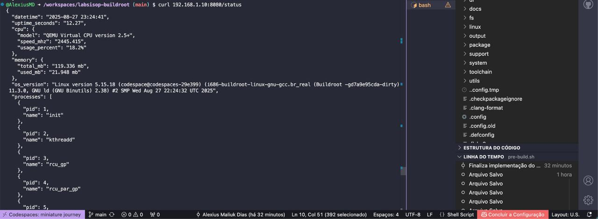
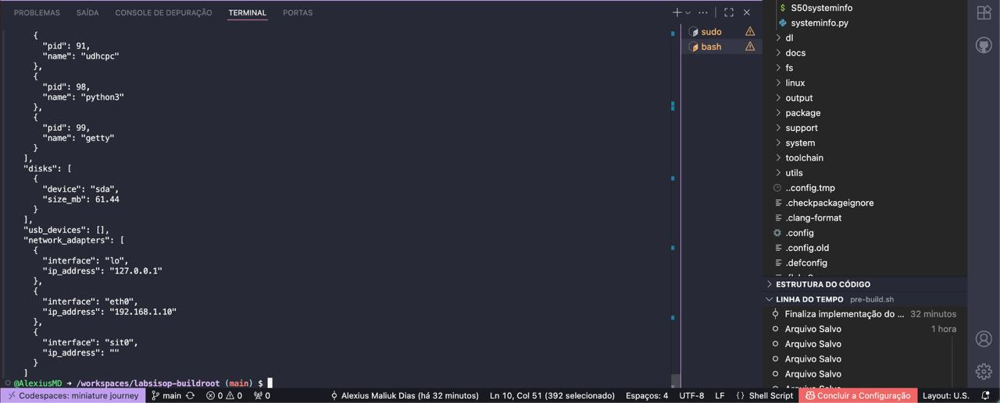
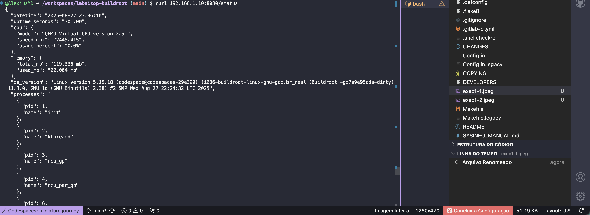

# System Status HTTP Server

## Instruções para Execução do Programa

Este programa implementa um servidor HTTP em Python que expõe informações do sistema operacional Linux através do endpoint `/status`.

### Requisitos
- Python 3
- Buildroot com suporte a `/proc` e `/sys` habilitado

### Execução
1. Copie o arquivo `systeminfo.py` para o sistema alvo.
2. Garanta que o arquivo seja executável:
   ```bash
   chmod +x systeminfo.py
   ```
3. Inicie o servidor:
   ```bash
   ./systeminfo.py
   ```
4. Acesse via navegador ou `curl`:
   ```bash
   curl http://<ip-do-dispositivo>:8080/status
   ```
No ambiente do codespaces onde o trabalho foi desenvolvido, o arquivo systeminfo.py e um script shell para sua execução foram inclusos na basta buildroot/custom-scripts, além de serem movidos a /etc/init.d do computador target a partir do pre-build.sh
## Capturas de Tela das Respostas do Endpoint /status







## Conteúdo da requisição em texto para melhor leitura

```
{
  "datetime": "2025-08-27 23:24:41",
  "uptime_seconds": "12.27",
  "cpu": {
    "model": "QEMU Virtual CPU version 2.5+",
    "speed_mhz": "2445.415",
    "usage_percent": "18.2%"
  },
  "memory": {
    "total_mb": "119.336 mb",
    "used_mb": "21.948 mb"
  },
  "os_version": "Linux version 5.15.18 (codespace@codespaces-29e399) (i686-buildroot-linux-gnu-gcc.br_real (Buildroot -gd7a9e95cda-dirty) 11.3.0, GNU ld (GNU Binutils) 2.38) #2 SMP Wed Aug 27 22:24:32 UTC 2025",
  "processes": [
    {
      "pid": 1,
      "name": "init"
    },
    {
      "pid": 2,
      "name": "kthreadd"
    },
    {
      "pid": 3,
      "name": "rcu_gp"
    },
    {
      "pid": 4,
      "name": "rcu_par_gp"
    },
    {
      "pid": 5,
      "name": "kworker/0:0-ipv6_addrconf"
    },
    {
      "pid": 6,
      "name": "kworker/0:0H-events_highpri"
    },
    {
      "pid": 7,
      "name": "kworker/u2:0-writeback"
    },
    {
      "pid": 8,
      "name": "mm_percpu_wq"
    },
    {
      "pid": 9,
      "name": "ksoftirqd/0"
    },
    {
      "pid": 10,
      "name": "rcu_sched"
    },
    {
      "pid": 11,
      "name": "migration/0"
    },
    {
      "pid": 12,
      "name": "cpuhp/0"
    },
    {
      "pid": 13,
      "name": "kdevtmpfs"
    },
    {
      "pid": 14,
      "name": "netns"
    },
    {
      "pid": 15,
      "name": "inet_frag_wq"
    },
    {
      "pid": 16,
      "name": "oom_reaper"
    },
    {
      "pid": 17,
      "name": "writeback"
    },
    {
      "pid": 18,
      "name": "kcompactd0"
    },
    {
      "pid": 19,
      "name": "kblockd"
    },
    {
      "pid": 20,
      "name": "kworker/0:1-events"
    },
    {
      "pid": 21,
      "name": "ata_sff"
    },
    {
      "pid": 22,
      "name": "kswapd0"
    },
    {
      "pid": 23,
      "name": "kworker/0:1H-kblockd"
    },
    {
      "pid": 24,
      "name": "acpi_thermal_pm"
    },
    {
      "pid": 25,
      "name": "kworker/u2:1-events_unbound"
    },
    {
      "pid": 26,
      "name": "scsi_eh_0"
    },
    {
      "pid": 27,
      "name": "scsi_tmf_0"
    },
    {
      "pid": 28,
      "name": "scsi_eh_1"
    },
    {
      "pid": 29,
      "name": "scsi_tmf_1"
    },
    {
      "pid": 30,
      "name": "kworker/u2:2"
    },
    {
      "pid": 31,
      "name": "kworker/u2:3"
    },
    {
      "pid": 32,
      "name": "mld"
    },
    {
      "pid": 33,
      "name": "ipv6_addrconf"
    },
    {
      "pid": 34,
      "name": "kworker/0:2-events"
    },
    {
      "pid": 35,
      "name": "ext4-rsv-conver"
    },
    {
      "pid": 52,
      "name": "syslogd"
    },
    {
      "pid": 56,
      "name": "klogd"
    },
    {
      "pid": 91,
      "name": "udhcpc"
    },
    {
      "pid": 98,
      "name": "python3"
    },
    {
      "pid": 99,
      "name": "getty"
    }
  ],
  "disks": [
    {
      "device": "sda",
      "size_mb": 61.44
    }
  ],
  "usb_devices": [],
  "network_adapters": [
    {
      "interface": "lo",
      "ip_address": "127.0.0.1"
    },
    {
      "interface": "eth0",
      "ip_address": "192.168.1.10"
    },
    {
      "interface": "sit0",
      "ip_address": ""
    }
  ]
}

```


## Explicação de Como Cada Informação é Obtida de /proc e /sys

Abaixo, uma explicação breve de como cada campo do JSON de resposta é extraído dos arquivos em `/proc` e `/sys`. O código usa funções auxiliares para ler esses arquivos e processar os dados.

- **datetime**  
  Obtido de `/sys/class/rtc/rtc0/since_epoch`, que fornece o tempo em segundos desde o epoch. Esse valor é convertido para uma string no formato `YYYY-MM-DD HH:MM:SS` utilizando `datetime.fromtimestamp`.

- **uptime_seconds**  
  Lido de `/proc/uptime`. O arquivo contém dois números, sendo o primeiro o tempo total desde o boot do sistema em segundos.

- **cpu**  
  - **model** e **speed_mhz**: extraídos de `/proc/cpuinfo` usando a função `get_info_file_dict`.  
  - **usage_percent**: calculado a partir de `/proc/stat`. A função lê duas vezes os valores de tempo de CPU (idle e total), com um pequeno intervalo. Em seguida calcula a porcentagem de uso com a fórmula `(1 - idle_diff / total_diff) * 100`.

- **memory**  
  Obtido de `/proc/meminfo`. Os campos `MemTotal` e `MemFree` são usados para calcular:  
  - **total_mb**: valor total de memória disponível em MB.  
  - **used_mb**: diferença entre total e livre, indicando memória em uso.  

- **os_version**  
  Lido integralmente de `/proc/version`, que contém a versão do kernel, compilador e informações de build.

- **processes**  
  Varre o diretório `/proc`, identificando subdiretórios numéricos (que representam PIDs ativos). Para cada PID, lê o nome do processo em `/proc/<PID>/comm` e monta uma lista de objetos `{ pid, name }`.

- **disks**  
  Obtido de `/proc/partitions`. O código ignora o cabeçalho e processa cada linha para extrair o nome do dispositivo (ex: `sda`, `mmcblk0`) e o tamanho em MB (convertido de KB).

- **usb_devices**  
  Percorre os diretórios em `/sys/bus/usb/devices`. Para cada dispositivo válido (que contém o arquivo `product`), lê a descrição de `/sys/bus/usb/devices/<dir>/product` e retorna `{ port, description }`.

- **network_adapters**  
  Lido de `/proc/net/dev`, que lista interfaces de rede. Cada linha contém estatísticas; o código extrai o nome da interface e tenta obter o endereço IP associado através de chamada `ioctl` (`SIOCGIFADDR`). Cada item da lista contém `{ interface, ip_address }`.